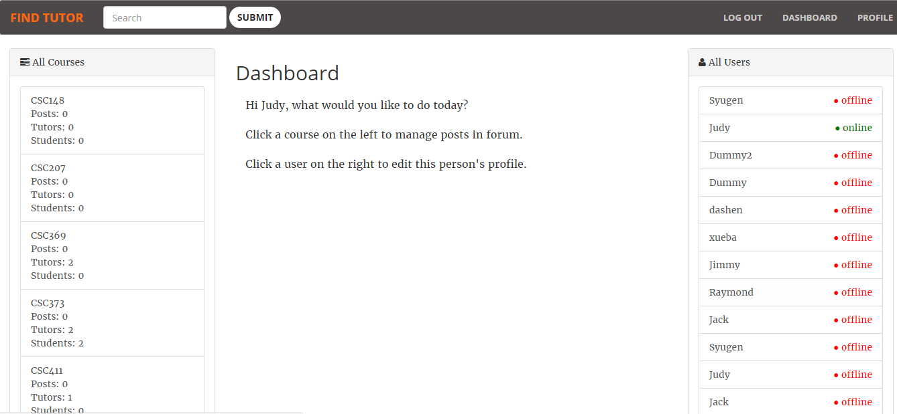

# Find Tutor
This is the project done in a group of four, in the 'CSC309H1 - Programming on the Web' course. 

## Introduction

* Topic: Tutor Website for U of T students.

* Purpose: Allow students to connect with other students (tutors) in order to get help for courses they are enrolled in.

* Users: In theory, the target users should be all students from U of T. However, for the purpose of demonstration, the users for this Application will be U of T Computer Science students.

## Hosting/Deployment

<b>To get the server function(For MAC OS X):</b>

1. Make sure <a href=https://docs.mongodb.com/manual/installation/?jmp=footer>MongoDB Community edition</a> is installed

2. In terminal, cd into the cloned project directory

3. Run `./start_db.sh`

4. Open another terminal, repeat step 2 and then run `./start_server.sh`

5. In the browser, set the url as `localhost:3000` and press enter

## Required list of features

### Different views
#### Index

* Before users login/signup, the first view they see will be the index page. Users can click on the top left "find tutor" icon to get to this page. When users login and clicks on "find tutor", they will be directed to the dashboard.
* Before users login, the buttons on the navigation bar are "find tutor", "login" and "signup". When users login, the buttons will be "find tutor", "dashboard", "profile" and "logout".

#### Dashboard

* The dashboard has three main panels. The panel on the left are all the course forums this user added and the panel on the right are all the students and tutors this user connected with. The admin user can see all users and courses on their dashboard.
* The middle panel for the admin is just instructions to manage users. For students and tutors, the middle panel allows students to post questions regarding a course or allows tutors to post time and prices to meet.

#### Course

* The course forum is a place for students or tutors to post ideas about the course.

#### Profile

* The profile includes all courses, friends and posts that one user has. Users can view the profiles of other users.

### User profile, authentication
#### Login

Users can signup/login by clicking on the buttons on the top right hand corner of the navigation bar.

* Authentication:
 * Passwords musts be 6-20 characters long
 * Existing users cannot signup
 * Non-existing users cannot login

#### Student Profile

* Students and tutors can edit their own profile page. They can add email, change password, and add an introdution paragraph.

### Data set
#### Seed

* Sets of data can be added, deleted, edited and searched. They can be imported by calling mongoimport, which are included in the 'start_server.sh'.

### Admin functionality
#### Admin dashboard

* Admin users can manage all users and courses. They can see all user profiles, postings and courses.

### Search
#### Search

* Users can search for courses and tutors. When they search for courses by course code, the course forum and a list of tutors and their postings for this course will be shown. The user can add the course to the user's main dashboard and click on the course to open the forum. The user can also click on "make friends" with the tutor and add that tutor to the user's main dashboard.
* When users search for tutors by name, all postings by that person will be shown.
* If you are logged in as an Admin, all postings by both students and tutors will be shown.
  

## Notable/Creative features

* nunjucks: HTML template
* socket.io: real-time update
* multer: upload files
* search field: smart search 
