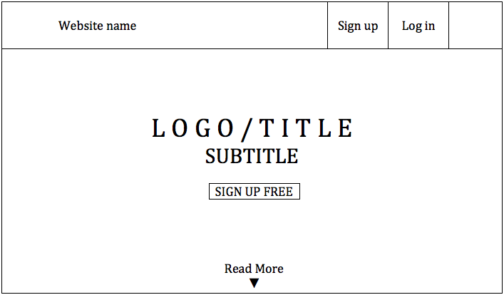
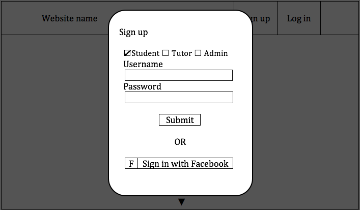
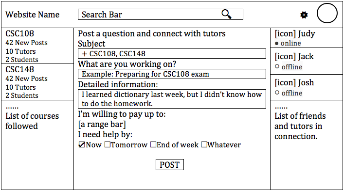
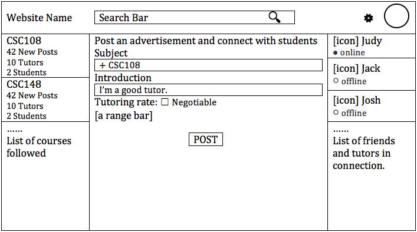
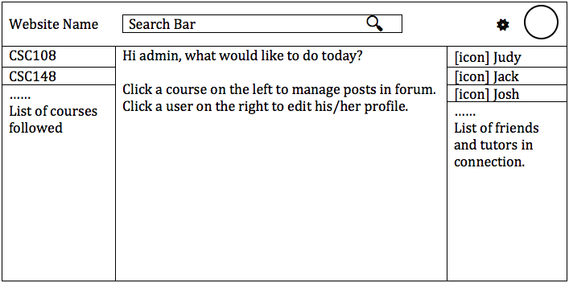
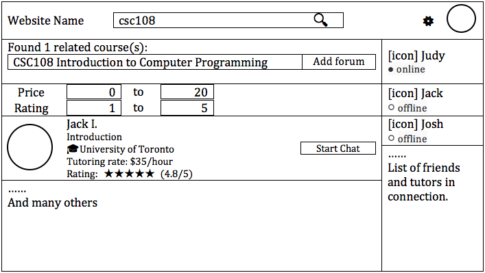
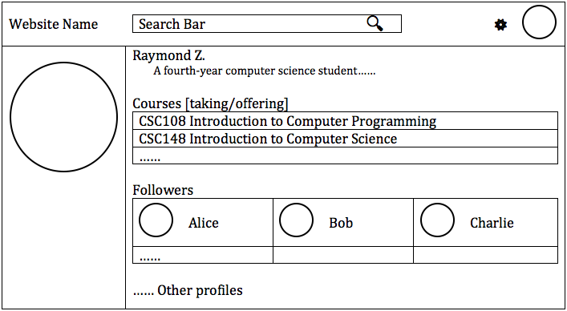
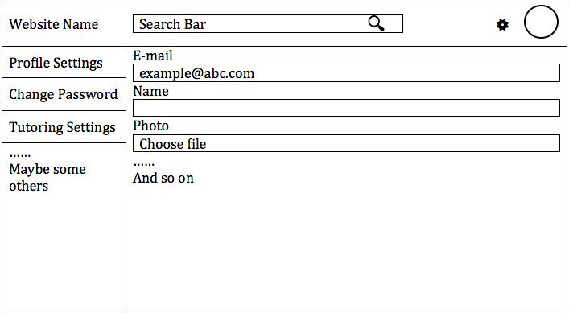
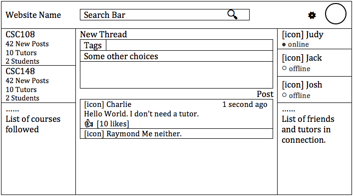
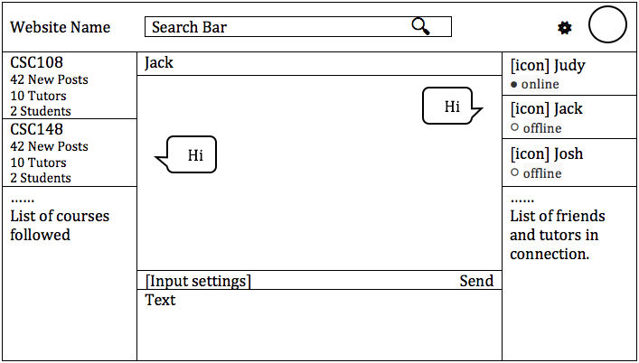

# Project Proposal

## Topic

* **Topic:** Tutor Website for U of T students.

* **Purpose:** Allow students to connect with other students (tutors) in order to get help for courses they are enrolled in.

* **Users:**  In theory, the target users should be all students from U of T. However, for the purpose of demonstration, the users for this Application will be U of T Computer Science students.

* **What users can do:** There are three different types of users: Admin, Tutor and Student. On a high level, users can use the website to chat 1-on-1 with other users, post thoughts about courses and search for tutors for courses. 

## List of the user interactions

For different users, there are different kinds of user interactions. All users can search for tutors based on tutor name/ course code, create user profile, view tutor profile, post threads under a course and chat with other students/tutors who want to connect and set times and places to meet up. Users can post in forums regarding a specific course that allows them to get answers from other students (not tutors) quickly.
 * Admin: The admin user (the project team) can edit and delete postings under the courses, manage all user profiles and chat with other users to handle user complaints. For example, if a conflict arise between the student and the tutor, the admin must intervine and help resolve the conflict. 
 * Tutor: Users can sign up to be a tutor by creating a tutor account which showcases their qualifications for a course.
 * Students: Students can edit their own profile.

## Getting data into application

* **Profile:** Information given by user, when they sign up.

* **Posts / Messages:** all based on user input.

* **Course Information:** We will scrape the course data from the U of T Arts & Science course offerings website and input that data into the database. Therefore, when the user signs up to be a tutor they can select the courses they want to tutor from a static list, given by our database.

## Sketches

### Start-up

This is the front page when the user opens the website.

### Sign up

When the user clicks on "sign up" button on the "start-up" page, the pop-up appears. Users can choose to be student, tutor or admin. Then they enter their username and password.

### Upon logged in as student

The main page when a student user logins on displays the courses they subscribed on the left panel, other students who are online or offline on the right panel. In the middle, they can post a question about a certain subject under that subject's forum. When they click "post", the message will be posted to the respective subject page.

Users can search for tutor name/ course code/ using the search bar.

### Upon logged in as tutor

Similar to the student main page, tutors can post their profile under the subject page.

### Upon logged in as admin

The admin has a different main page. They can see a list of all courses on the left and click on it to edit/delete all posts under that course page. They can also edit/delete user profile on the right.

### Search

When any user search for a course code and a related course is found, they can add that course to the "forum" which is the left panel that shows up on the users' main page. Also, a list of tutors for this course is listed beow. 

### Profile

When the users click on the name of the tutor/student, their profile appears. Students can choose of follow that tutor/student.

### Edit profile

This is the editing panel where users update information about their profile.

### Course forum

The forum is accessed by clicking on the course on the left panel. All threads posted by students and tutors show up.

### Private chat

The view to chat with other users.
